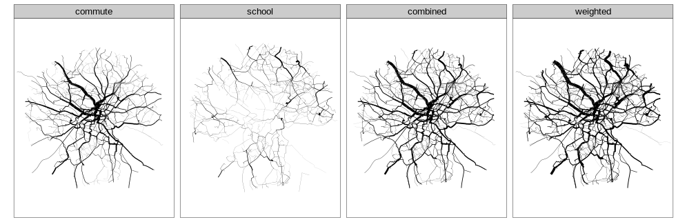

<!-- README.md is generated from README.Rmd. Please edit that file -->

```{r, include = FALSE}
knitr::opts_chunk$set(
  echo = FALSE,
  collapse = TRUE,
  comment = "#>"
)
```

# Introduction

<!-- badges: start -->
<!-- badges: end -->

The goal of this project is to explore how we can identify residential zones that would be served by a major safe route to school.

The outputs should provide evidence in support of 'liveable streets', where the emphasis is on reducing car vehicle speeds and volumes, and 'filtered permeability', where through traffic is allowed for cycling and walking, but not driving. Evidence can be used to support improvements such as segregated or on-road cycle routes and to aid in determining where the best locations are for these routes to be built.

Inactivity is a major cause of a range of physical and mental health conditions and it is especially important that children are physically active. Enabling children to travel safely to school by bicycle will help them to remain active while at the same time contributing to reductions in air pollution, congestion and carbon emissions.

Reducing air pollution around schools is a key concern. This was recently highlighted by the London Councils Environment Directors' Network and the Association of Directors of Public Health, who called for "action to mitigate pollution hotspots, particularly those around schools" (ref). Meanwhile, Leeds has seen a proposal to build a new car-free primary school, designed with no parking spaces for staff or visitors and where drop-offs will be discouraged (ref). 

Travel to schools can also be seen as a way of representing other journeys within residential areas. In contrast with workplaces, which tend to be highly concentrated in city centres and out-of-town employment zones, schools are much more widely dispersed throughout residential areas such as suburbs, towns and villages; thus school journeys are likely to more closely align with the other non-commute journeys that people make within these residential areas, such as visiting friends or accessing local shops and services. 

We illustrate the potential for safe routes to schools using data from Leeds and West Yorkshire.

# Methods

To investigate cycle propensity, vector and raster approaches were explored, as illustrated in Figure \@ref(fig:combi1).

```{r combi1, out.width="50%", fig.show='hold', fig.cap = "Demonstration of vector vs raster representations of combined commute/school travel route networks in sample region (West Yorkshire)."}
knitr::include_graphics(c("combined rnet.png", "combined rnet 1km raster.png"))
```

This shows the aggregation effect of rasterising the road data.
At a higher resolution, we can see how individual roads are lost, but the overall picture is retained.

The raster approach should be helpful in identifying areas where several relatively high-usage cycle routes lie close to one another, such as areas close to schools perhaps. This is good for identifying the general locations where cycle improvements are likely to benefit the greatest number of people. Meanwhile, the vector approach reveals the underlying network of potential cycle routes, with a higher level of detail that enables us to pick out the roads that cyclists may be using. 

```{r combi2, out.width="33%", fig.show='hold', fig.cap="The vector route network, 100m and 200m resolution raster images for the centre of Leeds, showing the combined commute/school travel networks."}
# i = magick::image_read("200m_clxm_leeds_centre.png")
# i_border = magick::image_border(image = i, color = "white", geometry = "10x10")
# i_border
# magick::image_write(i_border, "200m_clxm_leeds_centre.png")
knitr::include_graphics(c("combined_rnet_leeds_centre.png", "100m_clxm_leeds_centre.png", "200m_clxm_leeds_centre.png"))
```

We must first identify residential zones then look at where these zones might be served by major safe routes to schools. Residential zones are defined as built-up areas with a non-zero population, using ONS data (ref). 

```{r combi3, out.width="50%", fig.show='hold', fig.cap="The location of schools, residential areas, and heavily used routes to schools in the Leeds and Bradford area."}
knitr::include_graphics(c("schools_and_lsoa.png","routes_schools_intersch.png"))
```
(i)(left) Showing routes which are estimated to carry at least 100 journeys to school under the dutch_slc scenario. Schools are in black, with LSOA centroids in yellow, and built-up areas in grey as derived from ONS data. (ii)(right) Schools in green, with residential areas defined as areas within 800m of an LSOA centroid. Routes are clipped within the ONS-defined built-up areas.

An additional method we applied to the route network data was to group the streets into connected networks.
This was to highlight areas, not just single streets, where a dense network of cycle infrastructure could be particularly beneficial.
A simplified visualisation of the results of this grouping process, which was undertaken using the graph analysis R package `igraph`, is shown in Figure \@ref(fig:rnet-membership).

```{r rnet-membership, out.width="50%", fig.show='hold', fig.cap="Route networks with high cycle to school potential (100+ trips per day under Go Dutch) grouped by connectivity, with the largest 4 groups in terms of number of segments highlighted by colour (left). A zoomed-in view of the second largest group."}
knitr::include_graphics(c("Plots/rnet-membership-4-groups.png","Plots/rnet-group2.png"))
```

To gain an even broader picture of where people cycle, we can now combine the routes to schools with cycle routes used for commuting. As we've seen, travel to schools mostly takes place within residential areas, while commuter journeys are more strongly focused on town and city centres. Leeds provides a striking illustration of this, since in recent decades there were virtually no city centre residents at all. The population of Leeds city centre is now rising (this mostly post-dates the 2011 Census) but it remains low, and there are no schools within the core city centre. The combined analysis of commuter and school journeys reveals propensity to cycle across the city as a whole.

``` {r faceted, out.width="100%", fig.show="hold", fig.cap="Route networks of commute, school and combined cycle propensity in the 5km zone surrounding Leeds Railway Station"}

```

# Discussion

It is important to be aware that while these route networks can reveal a great deal about where people cycle, any given road section within the network may not necessarily be the one that is best suited to cycling or to cycle improvements. It may be there is a parallel street or off-road route that is better suited to cycling, and knowledge of local streets and conditions is vital here. 

For example, the vector map of the centre of Leeds shown in Figure \@ref(fig:combi2) shows a high-usage cycle route passing along Albion Street, Short Street and Lower Basinghall Street. This is a heavily used cycle corridor leading towards Leeds rail station, but local knowledge suggests that a more appropriate route for these journeys would most likely be on the nearby Park Row, which runs broadly parallel to these streets. Thus, this tool can provide an invaluable representation of the cycle route networks in a town or city, but a decision to undertake cycle improvements on a particular street also requires detailed knowledge of the local road conditions. This is the kind of information that CyIPT has been developed to assist in providing.


